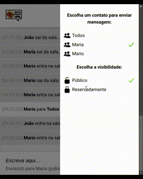

# Bate-Papo UOL (Versão Mobile)

Este é um projeto de bate-papo inspirado no antigo Bate-Papo UOL, criado com JavaScript e feito para dispositivos móveis.

## 🎬 Demo



## 📱 Funcionalidades

- **Interface Amigável para Mobile**: Interface minimalista e feita para uso em dispositivos móveis.
- **Bate-Papo em Tempo Real**: insira seu nome e converse com outros usuários em tempo real.
- **Conversas Privadas**: Escolha entre chats em grupo (Todos) ou conversas privadas selecionando pelo menu a outra pessoa.
- **Envio de Mensagens**: Envie e receba mensagens instantaneamente.
- **Experiência Nostálgica**: Inspirado no saudoso Bate-Papo UOL.

## 🚀 Tecnologias Utilizadas

- **JavaScript**: Implementação da lógica e das funcionalidades do chat.
- **HTML e CSS**: Estrutura e estilo da interface.

## 🛠 Como Executar o Projeto

1. Clone o repositório:
   ```bash
   git clone https://github.com/YureNathan/batePapoUol.git
